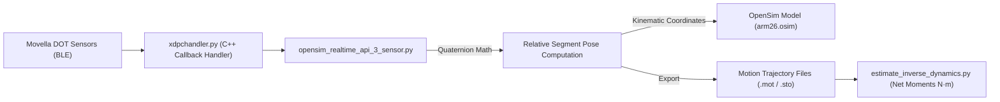

# Integration Report: Movella DOT Sensors with OpenSim SDK on Windows 11

## Executive Summary

This report provides an end-to-end guide for installing, configuring, and executing the **Movella (formerly Xsens) DOT Wearable IMU Motion Capture Pipeline** integrated with the **OpenSim Musculoskeletal Simulation Engine (v4.4)** on **Windows 11 (64-bit)**. 

The software suite acquires real-time Bluetooth Low Energy (BLE) orientation telemetry from multiple Movella DOT sensors, calculates relative segment kinematics (elbow flexion/extension, forearm pronation/supination, shoulder elevation), drives OpenSim biomechanical models (`arm26.osim`), exports standardized OpenSim files (`.sto`, `.mot`), and performs inverse dynamics torque estimation ($N \cdot m$).

---

## 1. System Requirements & Software Downloads

### Required Software Components

| Component | Recommended Version | Download / Installation Source | Notes |
| :--- | :--- | :--- | :--- |
| **Operating System** | Windows 11 (64-bit) | Microsoft Windows | Requires Bluetooth 4.2/5.0+ adapter. |
| **Python Interpreter** | Python 3.9 (64-bit) | [Python.org Downloads](https://www.python.org/downloads/release/python-390/) | Python 3.9 is required for Movella SDK wheel compatibility. |
| **Movella DOT PC SDK** | 2021.1.0+ Wheel | Movella Developer Portal | Distributed as a native C++ `.whl` package (`movelladot_pc_sdk-*-cp39-none-win_amd64.whl`). |
| **OpenSim Engine** | OpenSim 4.4 | [OpenSim Download Portal](https://simtk.org/projects/opensim) | Installed to default path `C:\OpenSim 4.4`. |
| **Integrated Development Environment** | VS Code / Antigravity IDE | Visual Studio Code / Antigravity | Workspace directory: `c:\Users\Srushti\Documents\MovellaProject`. |

---

## 2. Step-by-Step Environment & Dependency Setup

### Step 2.1: Python Environment Configuration

Open PowerShell or Command Prompt in your project workspace directory and verify Python version:

```powershell
python --version
# Should output: Python 3.9.x
```

### Step 2.2: Install Core Python Dependencies

Install required third-party libraries from [`requirements.txt`](file:///c:/Users/Srushti/Documents/MovellaProject/requirements.txt):

```powershell
pip install numpy>=1.20.3 pynput==1.7.3 matplotlib bleak python-pptx
```

### Step 2.3: Install Movella DOT PC SDK Wheel

Install the official Movella DOT PC SDK wheel file for Python 3.9 on 64-bit Windows:

```powershell
pip install movelladot_pc_sdk-2021.1.0-cp39-none-win_amd64.whl
```

---

## 3. Project Configuration & Hardware Setup

### Step 3.1: Configure Sensor MAC Address Whitelist

Before connecting sensors, locate the Bluetooth MAC addresses printed on the back of your Movella DOT nodes (or discover them using [`scan_sensors.py`](file:///c:/Users/Srushti/Documents/MovellaProject/scan_sensors.py)).

Edit [`user_settings.py`](file:///c:/Users/Srushti/Documents/MovellaProject/user_settings.py) to map your hardware MAC addresses to segment names:

```python
# user_settings.py
import getpass

dot_basename = "Movella DOT"
username = getpass.getuser().lower()

# TARGET SENSOR MAC ADDRESS MAPPING
whitelist = {
    "D4:22:CD:00:4B:76": "UpperArm",  # Sensor Node IX
    "D4:22:CD:00:4B:72": "Forearm",   # Sensor Node XI
    "D4:22:CD:00:4B:81": "Trunk"      # Sensor Node XIII
}

bluetooth_addresses = list(whitelist.keys())
```

---

## 4. OpenSim DLL Injection & Architecture Integration

### Windows 11 DLL Path Hook

In Python 3.8 and newer on Windows, native C++ DLLs are not automatically loaded from the system `PATH`. To allow Python to import OpenSim's C++ bindings (`import opensim as osm`), every real-time script includes the runtime DLL injection hook:

```python
import sys
import os

OPENSIM_BIN_PATH = r"C:\OpenSim 4.4\bin"
if os.path.exists(OPENSIM_BIN_PATH):
    os.environ['PATH'] = OPENSIM_BIN_PATH + os.pathsep + os.environ.get('PATH', '')
    if sys.version_info >= (3, 8):
        os.add_dll_directory(OPENSIM_BIN_PATH)
else:
    print(f"[!] Warning: OpenSim binaries directory missing at {OPENSIM_BIN_PATH}")

import opensim as osm
import movelladot_pc_sdk
from xdpchandler import XdpcHandler
```

---

## 5. Software Pipeline Architecture



### Core Subsystem Files

1. **[`xdpchandler.py`](file:///c:/Users/Srushti/Documents/MovellaProject/xdpchandler.py)**: C++ Callback Handler class extending `movelladot_pc_sdk.XsDotCallback`. Handles BLE scanning, device connection, and packet buffering.
2. **[`opensim_realtime_api_3_sensor.py`](file:///c:/Users/Srushti/Documents/MovellaProject/opensim_realtime_api_3_sensor.py)**: Primary real-time execution engine. Streams quaternions from 3 sensors (Upper Arm, Forearm, Trunk), computes elbow flexion (`r_elbow_flex`), forearm pronation/supination, and shoulder elevation (`r_shoulder_elev`), and updates OpenSim model coordinates.
3. **[`opensim_realtime_api.py`](file:///c:/Users/Srushti/Documents/MovellaProject/opensim_realtime_api.py)**: Dual-sensor version driving elbow kinematics on `arm26.osim`.
4. **[`movelladot_pc_sdk_receive_data.py`](file:///c:/Users/Srushti/Documents/MovellaProject/movelladot_pc_sdk_receive_data.py)**: High-fidelity logging script that resets sensor heading orientations in hardware (`device.resetOrientation(XRM_Heading)`) and compiles OpenSim `.sto` logs.
5. **[`estimate_inverse_dynamics.py`](file:///c:/Users/Srushti/Documents/MovellaProject/estimate_inverse_dynamics.py)**: Analytical inverse dynamics torque model estimating elbow joint moments ($N \cdot m$) under dumbbell loading conditions (0kg–3kg).

---

## 6. Step-by-Step Walkthrough to Run the Project

### Step 1: Mount the Sensors on the Subject

Following the sensor alignment guide:
- **Upper Arm Sensor**: Mount on lateral mid-humerus with flat face snug to skin.
- **Forearm Sensor**: Mount on dorsal-lateral forearm, centered on shaft.
- **Trunk Sensor**: Mount flat on upper chest/sternum.
- Have the subject adopt a **neutral posture** (elbow naturally extended, palm facing inward).

### Step 2: Verify Bluetooth Hardware Connections

Power on all Movella DOT sensors. Test scanner visibility:

```powershell
python scan_sensors.py
```

### Step 3: Run 3-Sensor Real-Time OpenSim Kinematic Tracking

Launch the main 3-sensor real-time pipeline:

```powershell
python opensim_realtime_api_3_sensor.py --trunk-mac D4:22:CD:00:4B:81
```

- The terminal will scan, connect to whitelisted sensors, and set measurement mode to `ExtendedQuaternion`.
- A 3-panel live Matplotlib visualization window will display:
  - **Panel 1**: Raw quaternion streams ($W, X$).
  - **Panel 2**: Calculated biomechanical joint angles (°).
  - **Panel 3**: Estimated joint angular velocities (°/s).
- Press `Ctrl + C` in the terminal to stop tracking. The script cleanly disconnects sensors and saves trajectory output to `arm26_arm_shoulder_motion.mot`.

### Step 4: Run Inverse Dynamics Torque Estimation

To compute joint moments ($N \cdot m$) across motion trials:

```powershell
python estimate_inverse_dynamics.py
```

This processes trial CSV recordings, applies signal smoothing (`np.convolve`), computes angular acceleration ($\alpha = \frac{d^2 \theta}{dt^2}$), and calculates net elbow joint moment:

$$M_{\text{net}} = I_{\text{eff}} \alpha + M_{\text{gravity, segment}} + M_{\text{gravity, load}}$$

Output summary plots are generated in `Xsens_Reading/inverse_dynamics_moment_curves.png`.

---

## 7. Troubleshooting & Engineering Gotchas

### Issue 1: `ImportError: DLL load failed` when importing `opensim`
- **Cause**: Python 3.8+ on Windows does not search `PATH` for C++ DLL dependencies automatically.
- **Fix**: Ensure `os.add_dll_directory(r"C:\OpenSim 4.4\bin")` is executed **before** `import opensim`.

### Issue 2: Sensors connect but return 0 Hz packet stream
- **Cause**: Windows 11 Bluetooth stack blocking GATT notifications or missing Client Characteristic Configuration Descriptor (CCCD) flags.
- **Fix**: Run [`unlock_and_test.py`](file:///c:/Users/Srushti/Documents/MovellaProject/unlock_and_test.py) to issue reset commands to `CONF_CONTROL_CHAR_UUID` (`15171002-...`) and write output mode `0x02`.

### Issue 3: Multi-sensor connection drops or latency spikes
- **Cause**: Bluetooth radio bandwidth congestion when connecting >3 sensors simultaneously on standard internal BLE adapters.
- **Fix**: Use an external Bluetooth 5.0 USB dongle and ensure sensors are set to General profile mode.
